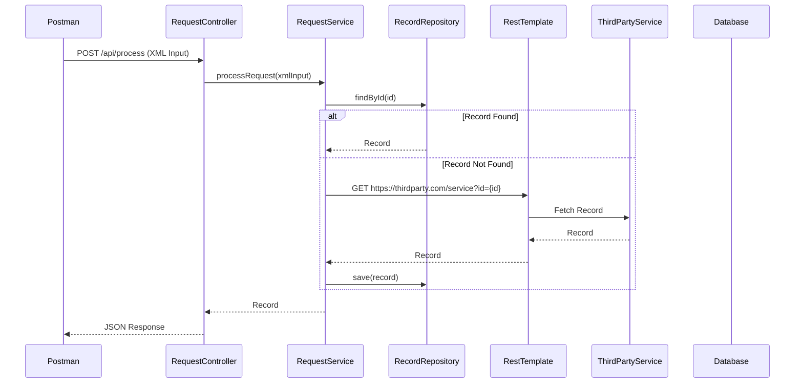

# Architecture Diagram

```mermaid
sequenceDiagram
    participant Postman
    participant RequestController
    participant RequestService
    participant RecordRepository
    participant RestTemplate
    participant ThirdPartyService
    participant Database

    Postman->>RequestController: POST /api/process (XML Input)
    RequestController->>RequestService: processRequest(xmlInput)
    RequestService->>RecordRepository: findById(id)
    alt Record Found
        RecordRepository-->>RequestService: Record
    else Record Not Found
        RequestService->>RestTemplate: GET https://thirdparty.com/service?id={id}
        RestTemplate->>ThirdPartyService: Fetch Record
        ThirdPartyService-->>RestTemplate: Record
        RestTemplate-->>RequestService: Record
        RequestService->>RecordRepository: save(record)
    end
    RequestService-->>RequestController: Record
    RequestController-->>Postman: JSON Response
```